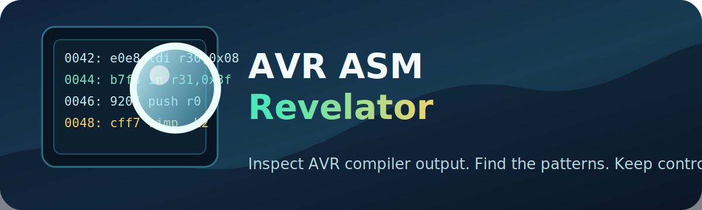

<p align="center">
  
</p>

# AVR ASM Revelator

AVR ASM Revelator is a read-only inspection tool for Atmel/Microchip AVR
compiler output. It parses avr-gcc assembly source and avr-objdump listings,
then produces programmer-focused Markdown, JSON, and optional annotated listing
reports.

Use it when you want to understand what avr-gcc emitted, spot conservative code
generation patterns, and review stack, register, interrupt, and timing-sensitive
sections without blindly rewriting compiler output.

## What It Finds

- Repeated `ldi` loads into AVR high registers.
- `ldi Rd, 0` sequences that may be better represented as `clr Rd`.
- Push/pop imbalance inside detected function boundaries.
- Interrupt handlers ending in `reti` that do not appear to save `SREG`.
- Skip/branch structures and branch-to-next-label patterns.
- Delay-loop signatures.
- Numeric I/O and SFR operands mapped back to common AVR register names where
  possible.

## Requirements

- Python 3.9 or newer.
- No third-party Python packages.
- An AVR `.s`, `.asm`, `.lst`, `.lss`, or `.txt` file.

## Quick Start

Clone the repository:

```bash
git clone https://github.com/RandoSY/avr-asm-revelator.git
cd avr-asm-revelator
```

Run a standard review:

```bash
python avr_asm_revelator.py path/to/firmware.lss --annotate
```

By default this writes:

- `firmware.lss.programmer_review.md`
- `firmware.lss.annotated.lst` when `--annotate` is used

Write JSON for automation:

```bash
python avr_asm_revelator.py path/to/firmware.lss --json review.json
```

Run a stricter review focused on the main program section:

```bash
python avr_asm_revelator.py build/target.lss \
  --min-severity STRONG \
  --focus maintext \
  --json audit.json
```

## Command-Line Reference

```text
usage: avr_asm_revelator.py [-h] [--report REPORT] [--json JSON]
                            [--annotate]
                            [--annotated-output ANNOTATED_OUTPUT]
                            [--min-severity {INFO,WARN,STRONG}]
                            [--focus {program,maintext,all}]
                            input
```

| Argument | Description |
|---|---|
| `input` | AVR `.s`, `.asm`, `.lst`, `.lss`, or `.txt` file to inspect. |
| `--report` | Markdown output path. Defaults to `<input>.programmer_review.md`. |
| `--json` | Optional machine-readable JSON output path. |
| `--annotate` | Writes an annotated listing with review comments inserted before flagged lines. |
| `--annotated-output` | Custom annotated listing output path. |
| `--min-severity` | Minimum finding severity: `INFO`, `WARN`, or `STRONG`. |
| `--focus` | Analysis scope: `program`, `maintext`, or `all`. |

## Generating AVR Listings

For many avr-gcc projects, an objdump listing is the most useful input:

```bash
avr-objdump -S -d build/firmware.elf > firmware.lss
```

You can also inspect generated assembly source when your build emits `.s` or
`.asm` files.

## Outputs

### Markdown Review

The Markdown report is meant for human review. It includes:

- Executive summary.
- Instruction mix.
- Special Function Register mapping.
- Source-line map when source references are available.
- Findings with local assembly context and suggested action.

### JSON Review

The JSON report is meant for CI, dashboards, or later tooling. It contains a
summary object and a list of structured findings.

```json
{
  "summary": {
    "physical_lines": 1200,
    "instruction_lines": 180,
    "rough_static_cycle_sum": 215.5
  },
  "findings": [
    {
      "severity": "WARN",
      "category": "REPEATED_LDI",
      "line": 240,
      "message": "Repeated LDI into r24."
    }
  ]
}
```

### Annotated Listing

When `--annotate` is enabled, the tool writes a copy of the listing with review
comments inserted immediately before flagged lines.

```asm
; -----------------------------------------------------------------------------
; REVIEW WARN REPEATED_LDI: Repeated LDI into r24.
; PARSED: ldi r24, 0x01
; WHY: Repeated literal loads may indicate compiler conservatism or source-level duplication.
; DO: Inspect nearby source logic if this occurs in a hot path.
; -----------------------------------------------------------------------------
  240: 81 e0        ldi r24, 0x01
```

## Severity Levels

| Severity | Meaning |
|---|---|
| `INFO` | Useful context or a common compiler pattern to review. |
| `WARN` | Suspicious or potentially wasteful output that deserves human inspection. |
| `STRONG` | Higher-confidence issue that is more likely to justify source or assembly review. |

## Analysis Scope

| Focus | Meaning |
|---|---|
| `program` | Default review scope for normal program listing sections. |
| `maintext` | Narrows review to the primary main-text execution section. |
| `all` | Reviews all recognized sections, including startup, vectors, and support blocks. |

## Important Notes

AVR ASM Revelator is a static review helper. It does not prove runtime behavior,
and its cycle estimates are orientation metrics rather than complete timing
analysis. Loops, interrupts, wait states, branch paths, linker layout, and MCU
variant all affect real execution.

The tool does not rewrite firmware. Treat every finding as a prompt for careful
review against the C source, generated assembly, datasheet, ABI rules, and
target hardware.

## Documentation

See [docs/operators_guide.md](docs/operators_guide.md) for the detailed operator
guide, including parser architecture, finding categories, and output formats.

## Contributing

Issues and pull requests are welcome. Useful contributions include:

- Additional avr-gcc or avr-objdump listing formats.
- New static-analysis heuristics with small examples.
- Tests built from shareable AVR listing snippets.
- Documentation for known compiler output patterns.

Generated `.lss`, `.lst`, `.elf`, `.hex`, review JSON, and annotated listing
outputs are ignored by default so public commits stay focused on source and
documentation.

## License

MIT. See [LICENSE](LICENSE).
